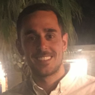

Hi, I'm Vince Pergolizzi. Welcome to my web site.

I am a backend software developer with 6 years of experience building data intensive applications.

Currently I am working at Athenahealth, helping to build a new microservice in the clinical quality management space.

Before that, I was at FortressGB doing backend development in the sports sector.

I have found that I am becoming more opinionated with each passing year of being in software. I hope to share these nuggets of wisdom with you on this site.

When I am not fighting computers, I am fighting humans. I am a purple belt in Brazilian Jiu-Jitsu under Roberto Maia.

### Resume

- Lead Software Developer at Athenahealth (May 2017 - Present)
- Software Developer at FortressGB (Feb 2012 - Apr 2017)
- Support Analyst at FortressGB (Nov 2010 - Jan 2012)

BSc, Computer Science from **THE** University of Hertfordshire
